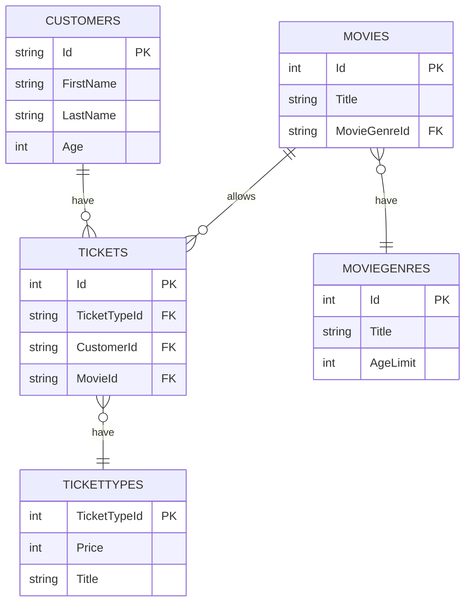

# movie-buster-backend

[Good .NET CORE 6 + MSSQL Initialization Tutorial](https://www.youtube.com/watch?v=48hC_GSrgCg&ab_channel=Aspdotnet-Pools)

## ERD

```mermaid
erDiagram
    MOVIES ||--o{ TICKETS : allows
    MOVIES {
        int Id PK
        string Title
        string MovieGenreId FK
    }
    MOVIES }o--|| MOVIEGENRES : have
    MOVIEGENRES {
        int Id PK
        string Title
        int AgeLimit
    }
    CUSTOMERS ||--o{ TICKETS : have
    TICKETS {
        int Id PK
        string TicketTypeId FK
        string CustomerId FK
        string MovieId FK
    }
    TICKETTYPES {
        int TicketTypeId PK
        int Price
        string Title
    }
    TICKETS }o--|| TICKETTYPES : have
    CUSTOMERS {
        string Id PK
        string FirstName
        string LastName
        int Age
    }
```